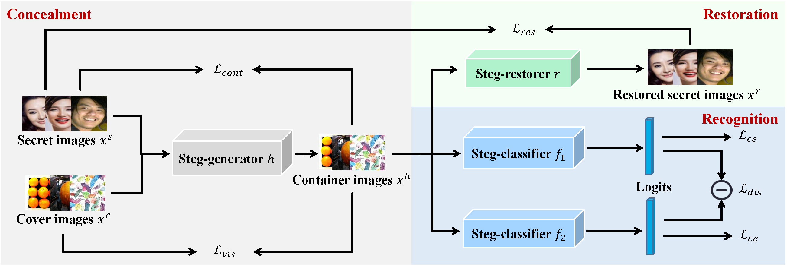
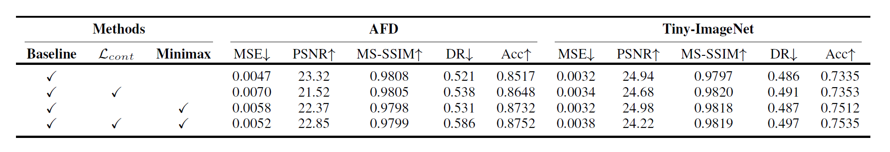
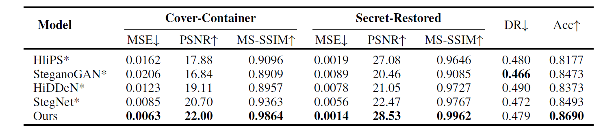
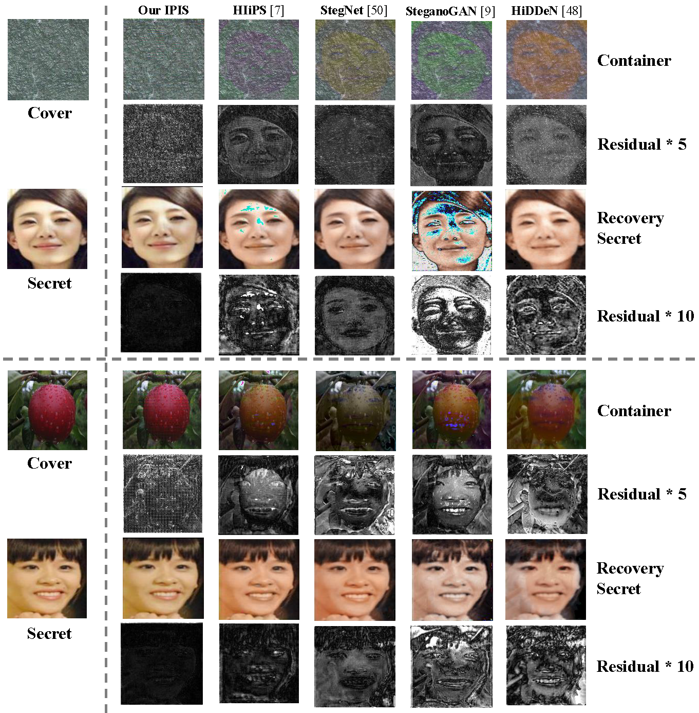

<h1>Multitask Identity-Aware Image Steganography via Minimax Optimization</h1>
PyTorch implementation of the paper "Multitask Identity-Aware Image Steganography via Minimax Optimization".



<h1>Install</h1>

We use the [Asian Face Image Dataset (AFD)](https://github.com/X-zhangyang/Asian-Face-Image-Dataset-AFD-dataset) dataset for face recognition.

Both the dataset and our pretrained models could be obtained from [GoogleDrive](https://drive.google.com/drive/folders/1XG7g2V6W3yz6gjP37_boOEVyG8K1FAJp?usp=sharing)/[BaiduDrive(code:2rgg)](https://pan.baidu.com/s/1gGBhDlGjlTG7FbslvoTUPQ).

More prerequisites could be seen in [requirements.txt](./requirements.txt).

<h1>Run Example</h1>
For single task version:

```
python AFD_minimax_simplify.py visualize
```

For multitask version:

```
python AFD_minimax_full.py visualize
```

There will be corresponding secret images, cover images(, restore images), container images in the **outputs** dir.
<h1>Training</h1>
For single task version:

```
python AFD_minimax_simplify.py train
```
For multitask version:

```
python AFD_minimax_full.py train
```
<h1>Testing</h1>

For single task version:

```
python AFD_minimax_simplify.py test
```
For multitask version:

```
python AFD_minimax_full.py test
```


<h1>Main Results</h1>





<h1>Citation</h1>

```
@article{cui2021multitask,
  title={Multitask Identity-Aware Image Steganography via Minimax Optimization},
  author={Cui, Jiabao and Zhang, Pengyi and Li, Songyuan and Zheng, Liangli and Bao, Cuizhu and Xia, Jupeng and Li, Xi},
  journal={arXiv preprint arXiv:2107.05819},
  year={2021}
}
```